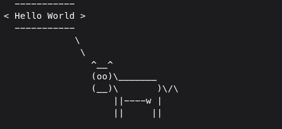

# Cowsay
<p align="center">
  Basically, cowsay, but in Java :)<br><br>
  
</p>

## Installation process
You can check the releases section and download the latest binary available. It's a single bundle created using GraalVM. After downloading the correct version, you can simply run it like:
```bash
./cowsay
```
Besides, if you want to, execute the following steps below to put it in your path:
```bash
mv cowsay-linux $HOME/.local/bin/cowsay
```
Then, just run: 
```bash
cowsay
```
